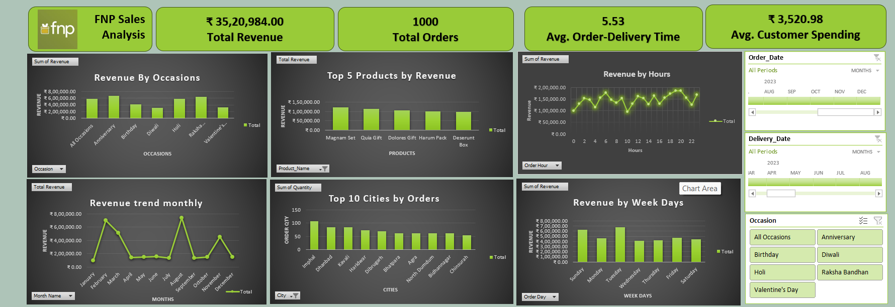

# 🌸 Ferns and Petals Sales Analysis (Excel Dashboard)
## 📌 Project Overview

This project analyzes the sales performance of Ferns and Petals (FNP), an online gifting platform specializing in occasions such as Diwali, Raksha Bandhan, Holi, Valentine's Day, Birthdays, and Anniversaries.

The dashboard was built in Microsoft Excel using Pivot Tables, Pivot Charts, KPI Cards, and Slicers to answer business questions and provide actionable insights.

## 🎯 Problem Statement

## 🛠 Tools Used
| Tool                   | Purpose               |
| ---------------------- | --------------------- |
| Microsoft Excel        | Data Analysis         |
| Pivot Tables           | Data Summarization    |
| Pivot Charts           | Visualization         |
| Slicers                | Interactive Filtering |
| Conditional Formatting | KPI Highlighting      |

## 📊 Dashboard Preview

